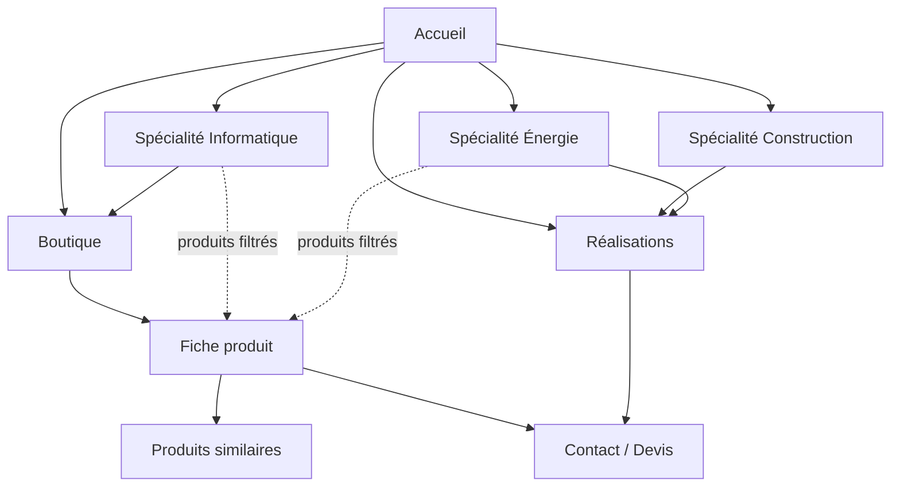

# Structure du site LK-TECH — arborescence & navigation

> **Document de référence** pour organiser le site public (vitrine + boutique).
> Il décrit l'arborescence **cible**, le rôle de chaque page, la navigation et
> le maillage interne, puis un **plan de mise en œuvre par phases**.
>
> Statuts : ✅ existe · 🆕 à créer (phase indiquée) · ⏳ plus tard

---

## 1. Principes directeurs

1. **Le site reste administrable sans technique** : tout le contenu des pages
   vit dans l'admin (stockage `data/`), les deux versions (PHP et Node) servent
   les mêmes pages — toute nouvelle page est créée **dans les deux versions**.
2. **Deux niveaux de profondeur maximum** : `page` et `page/{slug}`.
   Un visiteur trouve n'importe quelle information en 2 clics depuis l'accueil.
3. **Les trois spécialités sont la colonne vertébrale** : informatique,
   construction, énergie renouvelable. Chaque spécialité aura **sa propre page**
   qui concentre ses services, ses produits et ses réalisations.
4. **Une page = une intention** (SEO) : une recherche, une page.
   L'accueil convertit ; les pages profondes informent et référencent.
5. **L'accueil reste complet mais allège la boutique** : il montre une
   *sélection* (6 produits) et renvoie vers la page `/boutique` pour le
   catalogue entier.
6. **Le paiement en ligne n'existe pas** : la conversion passe par le panier
   WhatsApp, les fiches produit et les demandes de devis — chaque page se
   termine donc par **un appel à l'action clair** (devis, appel, WhatsApp).

---

## 2. Arborescence cible

```
linksmartec.com
│
├── /  ...................................... ACCUEIL — vitrine + sélection    ✅ (à alléger)
│
├── /informatique  .......................... SPÉCIALITÉ Informatique        🆕 P1
├── /construction  .......................... SPÉCIALITÉ Construction        🆕 P1
├── /energie  ............................... SPÉCIALITÉ Énergie renouvelable 🆕 P1
│
├── /boutique  .............................. BOUTIQUE — catalogue complet    🆕 P1
│   └── /produit/{slug} ..................... FICHE PRODUIT                  ✅
│
├── /realisations  .......................... RÉALISATIONS — portfolio       🆕 P2
│   └── /realisations/{slug} ................ PROJET PHARE (détail)          ⏳ P3
│
├── /a-propos  .............................. À PROPOS                       ✅
├── /contact  ............................... CONTACT dédié                  🆕 P2
│
├── /blog  .................................. ACTUALITÉS & CONSEILS          ⏳ P3
│   └── /blog/{slug} ....................... ARTICLE                         ⏳ P3
│
├── /mentions-legales ....................... MENTIONS LÉGALES                🆕 P1
├── /cgv .................................... CONDITIONS GÉNÉRALES DE VENTE  🆕 P1
│
├── /admin  ................................ ADMINISTRATION                  ✅
└── /api/* ................................. API JSON                        ✅
```

**Historique vs cible** : aujourd'hui, spécialités, boutique, services et
contact sont de simples *sections ancrées* de l'accueil (`#specialites`,
`#boutique`…). La cible leur donne des **pages dédiées** tout en conservant
ces sections sur l'accueil comme aperçus — les ancres redirigent alors vers
les pages.

---

## 3. Détail page par page

### 3.1 `/` — Accueil *(existant, à alléger)*

**Rôle** : donner envie en 10 secondes, montrer l'étendue des trois pôles,
conduire vers les devis et la boutique.

| # | Section | Contenu | Changement |
|---|---|---|---|
| 1 | Hero à onglets | 3 spécialités, produit vedette | CTA « Découvrir » → **pages spécialités** (au lieu de `#services`) |
| 2 | Ruban spécialités | Raccourcis cliquables | → pages spécialités |
| 3 | Cartes spécialités | 3 cartes | → pages spécialités |
| 4 | Sélection boutique | **6 produits max** + lien « Toute la boutique → » | aujourd'hui : 8 produits + filtres → à déplacer sur `/boutique` |
| 5 | Services | 6 prestations | chaque carte → page spécialité correspondante |
| 6 | Approche | 4 étapes | inchangé |
| 7 | Contact compact | formulaire + coordonnées | conservé ; lien vers `/contact` complet |

**SEO** : titre générique marque + métier (inchangé).

### 3.2 `/informatique` · `/construction` · `/energie` — Pages spécialités *(à créer, P1)*

**Rôle** : la page d'atterrissage de chaque pôle d'expertise — c'est elle qui
se référencera sur les recherches métier (« installation solaire Goma »,
« entreprise BTP Nord-Kivu », « développement logiciel RDC »).

Structure identique pour les trois :

1. **En-tête** — sur-titre, titre, texte d'introduction (issu de l'onglet hero
   correspondant), fil d'Ariane `Accueil › Spécialités › {nom}` ;
2. **Prestations** — les services de la spécialité (filtrés depuis l'admin) ;
3. **Produits** — la sélection de la spécialité (filtre boutique identique) ;
4. **Réalisations** *(dès la phase 2)* — 3 projets de la spécialité ;
5. **Approche** — rappel des 4 étapes (si pertinent) ;
6. **CTA final** — « Demander un devis » + « Nous appeler ».

**Données** : reprendre `hero.onglets[]` (textes) + `specialites[]` +
`services[]` filtrés + `produits[]` filtrés — **aucune nouvelle saisie
obligatoire** pour lancer les pages.

**SEO** : `Énergie renouvelable à Goma — kits solaires | LK-TECH` ;
JSON-LD `Service` ; canonical par spécialité.

> **Choix d'URL** : formes courtes (`/energie`) recommandées — mémorisables,
> mot-clé en évidence, cohérentes avec `/a-propos`. Alternative longue
> (`/specialites/energie`) si vous préférez regrouper sous un préfixe.

### 3.3 `/boutique` — Catalogue *(à créer, P1)*

**Rôle** : lister **tout** le catalogue avec les filtres permanents
(Tout · Informatique · Énergie · Terroir), la recherche par nom, et un
encart « Sur commande / devis » pour le matériel non stocké.

- Reprise exacte du rendu actuel des cartes (lien fiche + « Ajouter ») ;
- en-tête `Accueil › Boutique` + texte administrable ;
- si 0 produit dans un filtre : message + lien vers le devis (comportement
  actuel de la carte vedette).

**SEO** : `Boutique — matériel informatique, solaire et produits du Kivu | LK-TECH`.
JSON-LD `ItemList`.

### 3.4 `/produit/{slug}` — Fiche produit *(existant ✅)*

Rien à changer structurellement. À ajouter quand les pages liées existeront :

- la catégorie cliquable → **page spécialité** ;
- « Paiement à la livraison » → lien vers `/cgv` ;
- produits similaires → déjà en place.

### 3.5 `/realisations` — Portfolio *(à créer, P2)*

**Rôle** : prouver (« 150+ projets livrés » doit se voir). Grille de projets
avec photo, spécialité, lieu, année, description courte.

- Filtres par spécialité (même mécanique que la boutique) ;
- chaque carte peut devenir une page détail `/realisations/{slug}` en P3
  (galerie, contexte, solutions apportées) ;
- administrable : nouvel onglet **Réalisations** dans l'admin (comme Produits).

### 3.6 `/a-propos` — À propos *(existant ✅)*

Inchangé. À terme : lien vers `/realisations` dans le bloc « chiffres clés ».

### 3.7 `/contact` — Contact dédié *(à créer, P2)*

**Rôle** : centraliser tous les canaux — formulaire (existant), téléphone,
WhatsApp direct, e-mail, horaires, adresse + plan (OpenStreetMap embarqué,
sans clé API), et un encart « délai de réponse ».

L'accueil garde son formulaire compact ; la page ajoute la carte et les
canaux directs. Canonical distinct pour éviter le contenu dupliqué.

### 3.8 `/mentions-legales` et `/cgv` — Pages légales *(à créer, P1)*

Obligatoires pour un site marchand, même sans paiement en ligne :

- **Mentions légales** : éditeur (RCCM, adresse), hébergeur, propriété
  intellectuelle, données personnelles (formulaire de contact) ;
- **CGV** : prix en USD, commande par WhatsApp/panier, paiement à la livraison,
  livraison & installation (Goma, Nord-Kivu), garanties, retours, réclamations.

Ce sont des pages semi-statiques (texte modifiable dans l'admin → onglet
**Pages légales**), `noindex` pour les CGV, indexées pour les mentions.

### 3.9 `/blog` — Actualités & conseils *(P3)*

Conseils techniques (« dimensionner un kit solaire », « choisir un onduleur »,
« sécuriser son réseau Wi-Fi ») pour asseoir l'expertise et capter la
recherche d'information. Structure identique aux réalisations.

---

## 4. Navigation

### 4.1 Menu principal (toutes les pages)

```
Accueil | Spécialités ▾ | Boutique | Réalisations | À propos | Contact | [Devis gratuit]
              ├─ Informatique
              ├─ Construction
              └─ Énergie renouvelable
```

- « Spécialités ▾ » : menu déroulant sur ordinateur ; sur mobile, les trois
  entrées s'affichent directement dans le volet du burger (pas de sous-niveau
  caché sur petit écran) ;
- « Devis gratuit » reste le bouton d'action coloré (→ `/contact`) ;
- le panier 🛒 reste dans la barre d'action.

### 4.2 Pied de page

| Colonne | Contenu |
|---|---|
| Marque | logo clair, nom, description |
| Navigation | Accueil · Boutique · Réalisations · À propos · Contact |
| Nos spécialités | les **3 pages spécialités** + « Toute la boutique » |
| Coordonnées | adresse, téléphone, e-mail, site, RCCM, réseaux sociaux |

Barre du bas : `© {année} LK-TECH` · **Mentions légales** · **CGV** · « Conçu à Goma 🇨🇩 ».

### 4.3 Fil d'Ariane (toutes les pages profondes)

`Accueil › {Page} › {Élément}` — déjà en place sur À propos et fiches produit ;
à généraliser aux nouvelles pages. JSON-LD `BreadcrumbList` partout.

### 4.4 Maillage interne — règles



1. Toute page spécialité pointe vers : ses services (ancres internes), ses
   produits (fiches), ses réalisations, le devis ;
2. toute fiche produit ramène vers sa spécialité et la boutique ;
3. toute page se termine par un CTA (devis / appel / WhatsApp) ;
4. la page 404 propose la boutique et les trois spécialités ;
5. jamais de page orpheline : chaque page est atteignable depuis le menu
   **et** depuis au moins une page de contenu.

---

## 5. Conventions

| Sujet | Règle |
|---|---|
| URLs | kebab-case sans accent (slug existant : `slugifier()`), pas d'extension `.php` visible |
| Slugs produit | `/produit/{slug}` — auto depuis le nom, personnalisable dans l'admin |
| Ancres accueil | `/#specialites`, `/#boutique`… conservées mais redirigées en douceur vers les pages dédiées |
| Redirections | toute ancre devenue page : redirection 302 côté serveur ou lien direct mis à jour |
| Titres SEO | `{Page} \| LK-TECH — {précision}` ; fiche produit : `{Nom produit} \| LK-TECH — Boutique` |
| Données | tout contenu administrable vit dans `content.json` (admin), jamais en dur dans les pages |
| Miroir PHP/Node | chaque page = un fichier PHP à la racine **et** un template `node/src/*Page.js` |
| Sitemap | mis à jour à chaque page/rubrique ajoutée |

---

## 6. Plan de mise en œuvre

| Phase | Contenu | Effort estimé |
|---|---|---|
| **P0 — fait ✅** | accueil, à propos, fiches produit, admin, API | — |
| **P1 — socle** | pages spécialités ×3 · page `/boutique` · mentions légales · CGV · menu/pied/fil d'Ariane unifiés · sitemap | 1 itération |
| **P2 — preuve** | `/realisations` (admin : onglet Réalisations) · `/contact` dédié (carte + canaux) | 1 itération |
| **P3 — croissance** | `/blog` + articles · pages projet `/realisations/{slug}` · témoignages clients | à la demande |
| **P4 — commerce** | commandes enregistrées (checkout) + suivi de commande + gestion dans l'admin | à la demande |

Chaque phase est livrable indépendamment et immédiatement utile.

---

## 7. Décisions à valider avant la phase 1

1. **URLs des spécialités** : courtes (`/energie`) ou préfixées
   (`/specialites/energie`) ? → *recommandation : courtes* ;
2. **Produits du terroir** (miel, café, thé) : restent dans la boutique
   générale ou rubrique distincte mise en avant ? → *recommandation :
   boutique générale, filtre existant* ;
3. **Contact** : conserver le formulaire sur l'accueil **et** la page dédiée
   (recommandé), ou déplacer complètement ? ;
4. **CGV** : prix affichés en USD uniquement (actuel) ou aussi en CDF ?
5. **Qui fournit** les textes légaux (vous / votre conseil) ou je rédige une
   base à faire relire ?
